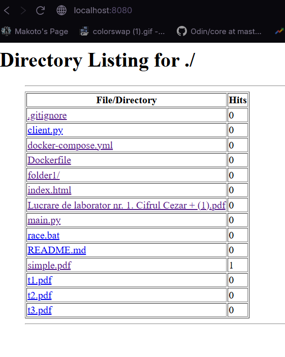

# Lab2

## Elaborated by: Burduja Adrian faf231

### Theory
A single threaded server has limited ability to serve multiple clients: it's
limited by the speed at which a single request is processed.

In order to fix this issue, each request can be handled in a separate thread.
This way, 1 request will not become the bottleneck of the server.

However, threads are not free, creating threads takes time and having them incurs
a memory cost(the memory a thread takes up is system dependant)
Moreover, processors ability to paralelyze is dependant on the number of cores.
If the number of threads exceeds the number of cores, the OS will start managing
the scheduling of the threads, which might be slow and inneficient

One way to amortize the cost of creating too many threads is to create a fixed number
upfront and managing them. This pattern is called a threadpool.

In multithreaded context, the nature of how code executes differs significatly from
simple singlethreaded contexts:
1. The order of the execution of the code in separate threads is not guarateed
2. Read/writes happen in steps, which can be interleaved between threads, corrupting
data

In order to solve these problems blocking,atomic operations and mutual exclusion are
utilised.

- Blocking: a behaviour where a processes execution is paused until it is unblocked.
Oftentimes IO operations block the parent process until they are finished, but 
sometimes they can be configured to not block.

- Atomic operations: a behaviour where an operation's context cannot be mutated while
it executes by other threads, as if the procedure happens in a single whole step.
Load and store operations are usually done in several steps at the machine code level
. In order to fix the issue of loads happening in the middle of a write(or vice versa)
, atomic operations are often provided by the cpu, or can be implemented using other
atomic primitives.

- Mutual exclusion (mutex): A lock that ensures that only 1 thread can unclock it at
a time. Mutexes are usually implemented using atomic operations.

If proper measures are not put in place to stop the interleaving of code where it
shouldn't, horrible bugs can occur which are notoriosly hard to detect and reproduce:
Race conditions.

- Race condition: a bug where the behaviour of the program is relient on the order
of the operations in different threads. Incorrect order leads to incorrect behaviour.

### Task In this lab, you will make your HTTP server multithreaded, so that it can handle multiple connections concurrently. You can either create a thread per request, or use a thread pool.
To test it, write a script that makes multiple concurrent requests to your server. Add a delay to the request handler to simulate work (~1s), make 10 concurrent requests and measure the amount of time in which they are handled. Do the same with the single-threaded server from the previous lab. Compare the two.
#### Counter: 2 points
Add a counter feature. Record the number of requests made to each file and show it in the directory listing. For example:
First, implement it in a naive way and show that there is a race condition (you can rewrite the code and add delays to force interlacing of threads). Then, use a synchronization mechanism (e.g. a lock) and show that the race condition is gone.
#### Rate limiting: 2 points
Implement rate limiting by client IP (~5 requests/second) in a thread-safe way. Have one friend spam you with requests and another send requests just below the rate limit. Compare the throughput for both (successful requests/second).

### Screenshots



### Implementation

## Multithreading:
In order to make use of the cores in my processor. For that I use the Threadpool that
is provided by the python std:
```python
    with socket.socket(socket.AF_INET,socket.SOCK_STREAM) as server: 
        server.bind(('0.0.0.0',8080))
        server.listen(8)

        with ThreadPoolExecutor(max_workers=8) as pool:
            while True:
                if len(client_map) > MAX_ENTRIES:
                    temp = client_map
                    client_map =copy_client_map
                    copy_client_map = temp
                    pool.submit(cleanup_file_map)

                client,addr = server.accept()
                client_ip =addr[0]
                pool.submit(handle_client,client)
```

`pool.submit` is a function that takes a function and some other argument as arguments,
and executes that function using the second parameter.


## Counter
This is implemeted simply: a dictionary with the relative path as the key and the 
number of accesses as the value.
```python
# definition
file_map:dict[str,int] = {}

# usage:
        if path in file_map: file_map[path] +=1
        else:file_map[path] = 1
```

## Rate limiting
```python
client_map:dict[str,tuple[float,int]] = {}
copy_client_map:dict[str,tuple[float,int]] = {}
MAX_ENTRIES = 1000

def cleanup_file_map():
    for (ip,(timestamp,requests)) in copy_client_map.items():
        if timestamp > now() + 60: del copy_client_map[ip]

# usage:

                    if client_ip not in client_map: client_map[client_ip] = (now(),1)
                    else:
                        (timestamp, requests) = client_map[client_ip]
                        if requests <= RATE_LIMIT: client_map[client_ip] = (now(), requests +1)
                        else:# if a second or more passed reset
                            if now() - timestamp >= 1: client_map[client_ip] = (now(),1)
                            else:
                                client.close()
                                continue # skip the client
# cleanup
                    if len(client_map) > MAX_ENTRIES:
                        temp = client_map
                        client_map =copy_client_map
                        copy_client_map = temp
                        pool.submit(cleanup_file_map)
```

## Thread safety

The aformentioned `file_map` is free to be read and mutated by any thread that handles
a request, because all operations on it must be atomic. To achive this behaviour, I 
implemented and utilized a read-write lock:
```python
class RW_Lock:
    def __init__(self):
        self.lock_read = threading.Lock()
        self.lock_write = threading.Lock()
        self.lock_readers = threading.Lock()
        self.readers = 0 
        
    # enable `with` syntax
    class Reader_Lock:
        def __init__(self,lock):  self.rwlock = lock
        def __enter__(self): return self
        def __exit__(self, exc_type, exc_val, exc_tb): self.rwlock.end_read()

    class Writer_Lock:
        def __init__(self,lock): self.rwlock = lock
        def __enter__(self): return self
        def __exit__(self, exc_type, exc_val, exc_tb): self.rwlock.end_write()

    def read(self):
        # guard against write starvation,writers take precedence
        # in order to write, one must first be able to aquire the read lock
        self.lock_read.acquire()
        self.lock_read.release() # release it imediatly after

        self.lock_readers.acquire()
        self.readers +=1
        if self.readers == 1: self.lock_write.acquire()
        self.lock_readers.release()

        return self.Reader_Lock(self)

    def end_read(self):
        assert self.readers > 0
        self.lock_readers.acquire()
        self.readers -=1
        if self.readers == 0: self.lock_write.release()
        self.lock_readers.release()

    def write(self):
        self.lock_read.acquire()
        self.lock_write.acquire()

        return self.Writer_Lock(self)

    def end_write(self):
        self.lock_write.release()
        self.lock_read.release()
```

A read write lock allows multiple threads to `read` at the same time, but only 1 thread
can write, and these operations cannot happen at the same time:
```python
# initialization
    files_lock = RW_Lock()

# read usage
    with caches_lock.read(): 
        should_open_file = (path not in cache_map) or not (cache_map[path])

# write usage:
    with files_lock.write():
        if path in file_map: file_map[path] +=1
        else:file_map[path] = 1
```


### Conclusion
This laboratory successfully enhanced the HTTP server with multithreading, thread-safe
counters, and rate limiting. The implementation used a ThreadPoolExecutor to handle 
concurrent connections, achieving significant performance improvements over the 
single-threaded version. A custom read-write lock was developed to resolve race 
conditions in the access counter, ensuring data consistency while maintaining 
performance. Rate limiting was implemented using a dual-map swapping mechanism to 
efficiently track client requests while preventing memory leaks. The project 
demonstrated practical understanding of concurrent programming challenges and their 
solutions, including proper synchronization techniques and resource management in 
multi-threaded environments.


