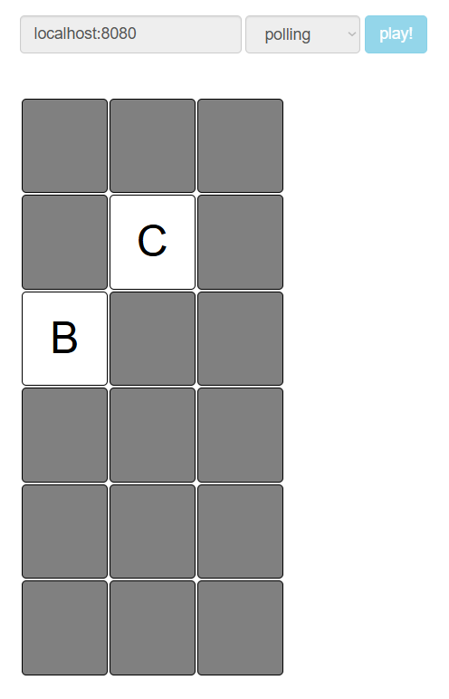
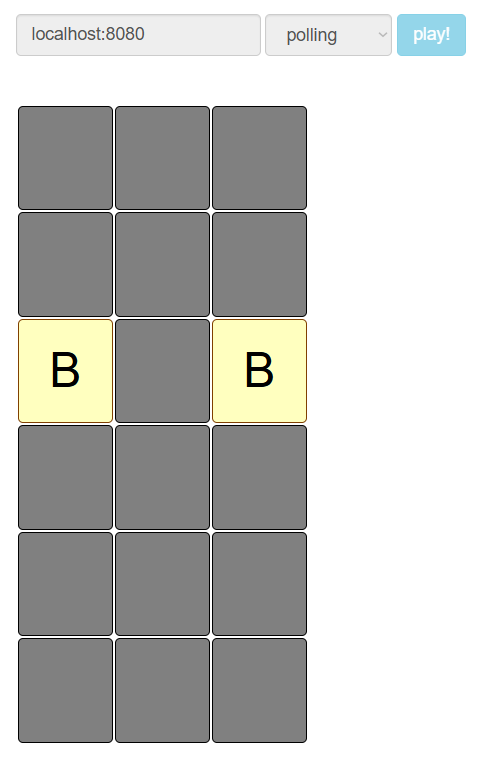
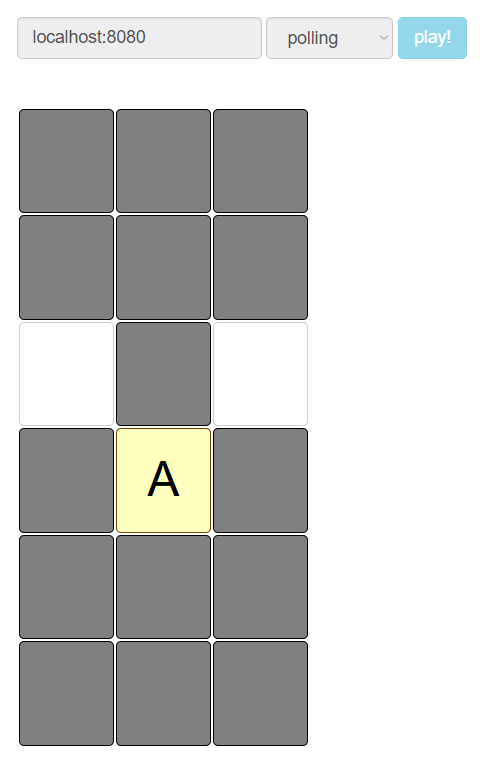
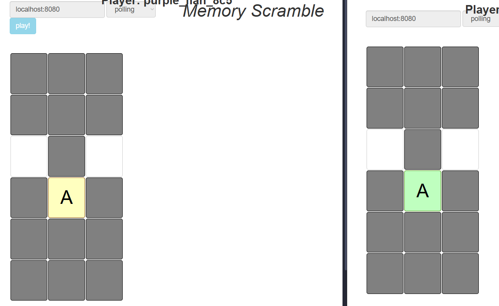
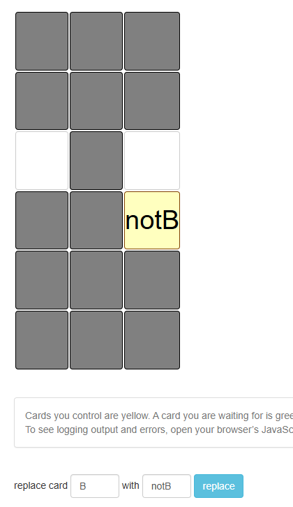

# Lab3

## Elaborated by: Burduja Adrian faf231

## Task
For this lab you will implement the MIT 6.102 (2025) Memory Scramble lab.
You can find the starter code that they provide to the students in this Github repo.
You are free to use any HTTP and unit test libraries.

## Screenshots








## Structure and Implementation

### The board
```The fallowing code might slightly differ from the code in the repository, it only server demonstratioanl purposes```

I choose to represent the board as an array of tiles, where a tile is described as:
```odin
Tile :: struct {
	card:      u64,
	flipped_by:u64,
	owner:     u64,
	watch:     sync.Cond,
	wait_list: [MAX_PLAYERS]u64,
}
```

The state of a single tile is defined by the card it houses, the player who owns it
and who previously flipped it,a list of playier waiting to aquire the tile and a 
condition variable that takes care to notify waiting players when the the tile is 
freed or removed.

The card and owner would normally be a string, however because of memory and performance
reasons I opted for a hash of those strings instead.

A removed tile(as happens when 2 of the same are revealed by 1 player) are signified by
having card = 0. A tile not owned by anyone is represented the same way.

The state of the tile being face-up or face-down is dependant on `flipped_by` being non-zero.

This is showcased in the `board_look` function which reads the table and formats the 
response based on the state:
```odin 
look :: proc(player_id: u64, e: ^Effect, loc := #caller_location) -> string {
	fmt.assertf(
		player_id != NO_STRING,
		"the player_id when calling look board should not be \"\"",
		loc = loc,
	)
	builder: str.Builder
	// unlikely to read the board in an invalid state. Also the board is a stabel
	// and static piece of memory
	if true  /* guard(&board_lock)*/{
		write_int(&builder, e.board_h)
		write_char(&builder, 'x')
		write_int(&builder, e.board_w)
		for tile in e.board {
			write_str(&builder, "\n")
			if tile.card == NO_STRING {
				// card was taken
				write_str(&builder, "none")
			} else if tile.owner == player_id {
				// owner is trying to take it
				write_str(&builder, "my ")
				write_str(&builder, e.hash_map[tile.card])
			} else if tile.owner == NO_STRING {
				write_str(&builder, "down")
			} else {
				// there is an owner, just not you
				write_str(&builder, "up ")
				write_str(&builder, e.hash_map[tile.card])
			}
		}
	}
	return str.to_string(builder)
}
```

To make mutations of the board simpler, the most oftenly used operations are factored
out into separate functions:
```odin
POS_INT_MAX: int : 1 << 63 - 1
//@game helpers
find_player_pos :: proc(
	player_id: u64,
	e: ^Effect,
	loc := #caller_location,
) -> (owned: [2]int,flipped: [2]int,) {
	loop: for tile, i in e.board {
		if tile.card == NO_STRING {
			// tiles without cards do not contain info
			continue loop
		}
		id := tile.owner
		if player_id == id {
			switch {
			case owned[0] == 0:
				owned[0] = i + 1
				flipped[0] = i + 1
			case owned[1] == 0:
				owned[1] = i + 1
				flipped[1] = i + 1
			}
			continue loop
		}
		id = tile.flipped_by
		if player_id == id {
			switch {
			case flipped[0] == 0:
				flipped[0] = i + 1
			case flipped[1] == 0:
				flipped[1] = i + 1
			}
		}
	}
	return
}
```

There is no state tracking for the previous choices of the players, instead I opted
to linearly search the board for the index of the tiles said player has flipped before.
This algorithm might look inefficient, however because the array is not an array of
structures but a structure of arrays: meaning each field is it's own attay, arranged
in the continuous memory. This factor coupled with the assumption, that on averege
this array would be relatively small makes this implementation exeedingly efficient.

One invarient that this finction checks is that the player must not hold more then 2
tiles. If this case is hit, the program is incorrect and in an invalid state and must 
terminate.

Another invarient is that the size of the board is smaller then the biggest positive
integer. This exists to ensure no integer overflow happens on the addition operation.

```odin
relinquish_tile :: proc(pos: int, e: ^Effect, loc := #caller_location) {
	e.board[pos].owner = pop_front(&e.board[pos].wait_list)
	if e.board[pos].owner != NO_STRING {e.board[pos].flipped_by = e.board[pos].owner}
	sync.cond_broadcast(&e.board[pos].watch)
}
```

`reninquish_tile` does 3 things that are integral to upholding the correct state of
the board:

1. It pops the first player from the waitlist and puts them as the new owner. If the 
waitlist is empty, the popped value would be 0, meaning the tile has no owner.
2. If the tile has gained an owner, it also puts them as the value for `flipped_by`
3. It notified possible waiting players that this tile was updated and they might have
become the owner

```odin
board_was_updated :: #force_inline proc(e: ^Effect) {
	if guard(&e.update_lock) {
		e.was_updated = true
		sync.cond_broadcast(&e.update_watch)
	}
}
```

This procedure simply broadcasts that the board was updated to the watch function.

```odin
flip_tile :: #force_inline proc(player_id: u64, tile_pos: int, e: ^Effect) -> (err: Game_err) 
```

`flip_tile` takes the player_id and the postion of the tile and performs the flip
based on the current state of the game `e` and the rules

#### Rule 3a:
```odin
		switch {

		case players_owned[0] != 0 && players_owned[1] != 0:
			tile1 := e.board[tiles_owned[0]]
			tile2 := e.board[tiles_owned[1]]

			//
			e.board[tiles_owned[0]].card = NO_STRING
			e.board[tiles_owned[1]].card = NO_STRING
			relinquish_tile(tiles_owned[0], e)
			relinquish_tile(tiles_owned[1], e)
			
			board_was_updated(e)
			fallthrough
```

If the player has 2 tiles owned on the board, that means that they
previously got a match. Since this would be the 3rd tile they choose
the tiles they they owned get removed from the board and any players
who were weiting on them are notified of the update, then the flow
fallows to the `1*` rules

Rule 3b is done in the proceeding code.

#### Rule 1abcd:
```odin
		case players_owned[0] + players_owned[1] == 0:
			// cleanup
			// 3b
			if tiles_flipped[0] > -1 do flip_free_facedown(tiles_flipped[0], e)
			if tiles_flipped[1] > -1 do flip_free_facedown(tiles_flipped[1], e)
			// #1-a
			if tile.card == NO_STRING {
				// no card here
				// operations fails and you do nothing
				board_was_updated(e)
				return .Conflict
			}

			// #1-bcd
			if tile.owner != NO_STRING {
				// # 1-d
				place_back(&tile.wait_list, player_id)
				wait_loop: for {
					sync.cond_wait(&tile.watch, &e.board_lock)
					if tile.owner == player_id {
						tile.flipped_by = player_id
						break wait_loop
					}
					if tile.card == NO_STRING {
						err = .Conflict
						break wait_loop
					}
				}
			} else {
				// # 1-bc
				tile.owner = player_id 
				tile.flipped_by = player_id
			}
			board_was_updated(e)
```

First thig this part of the code does it flipping face-down any cards that were
previously flipped by this player.

Then, rule `1a` is checked as this is an easy early return
Next, rules `1bcd` are applied:

- rule 1d: if the card has an owner, the player is put on the tiles waitlist.
The player wait for a signal from the tile's cond_var to know when to check if
they're free to move forwards, either when they've gained controll over the tile
or it was removed from the board.

- rule 1bc: else if the tile had no owner, the player is free to take controll over it

#### rules 2abcde:
```odin
		case players_owned[0] * players_owned[1] == 0:
			// #2-a
			if tile.card == NO_STRING {
				old_choice := tiles_owned[0] + tiles_owned[1]
				relinquish_tile(old_choice, e)
				board_was_updated(e)
				return .Conflict
			}
			// #2-b
			if tile.owner != NO_STRING {
				old_choice := tiles_owned[0] + tiles_owned[1]
				relinquish_tile(old_choice, e)
				board_was_updated(e)
				return .Conflict
			}
			// #2-cde
			tile.owner = player_id
			tile.flipped_by = player_id
			prev_tile_pos := tiles_owned[0] + tiles_owned[1]
			prev_tile := e.board[prev_tile_pos]

			if tile.card == prev_tile.card {
				// #2-cd
				// nothing happens, player still owns it
			} else {
				// #2-e
				relinquish_tile(prev_tile_pos, e)
				relinquish_tile(tile_pos, e)
				err = .Conflict
			}
			board_was_updated(e)
```

- rule 2a: first, the code checks if the tile has a card, if it doesn't rule 2a is
applied. The player loses controll over the previously owned tile and the function
exits.
- rule 2b: if the tile has an owner, the player simply relinquishes controll over the
previous tile and the function exits.
- rule 2cde: else, the player takes controll over the tile. 
	if the new tile and the previous tile match cards, the player keeps both
	else, the player relinquishes controll of both


#### map
```odin
board_map :: #force_inline proc(to, from: string, e: ^Effect) {
	if str.contains_any(to, " \r\n\t") do return .Conflict
	from_hash := hash(from)
	e.hash_map[from_hash] = str.clone(to, e.hash_map.allocator)
	board_was_updated(e)
	check_rep(e)
}
```

The above function does the mapping operation by simply substituting the key for
the has_map that is responsible to recover the original text of the hash, however
in this case it is no longer the original text but the text it was mapped to.

#### watch
```odin
board_watch :: #force_inline proc(e: ^Effect) {
	if guard(&e.update_lock) {
		for !e.was_updated do sync.cond_wait(&e.update_watch, &e.update_lock)
		e.was_updated = false
	}
	check_rep(e)
}
```

This procedure tries to aquire the update lock from the state, then waits on a cond_var
to be notified when an update occurs.

### Commands
```odin
flip :: proc(player_id: u64, tile_pos: int, e: ^Effect) -> (boardstate: string, err: Game_err) {
	err = flip_tile(player_id, tile_pos, e)
	return board_look(player_id, e), err
}

replace :: proc(to, from: string, player_id: u64, e: ^Effect) -> (string, Game_err) {
	return board_look(player_id, e), board_map(to, from, e)
}

watch :: proc(player_id: u64, e: ^Effect) -> string {
	board_watch(e)
	return board_look(player_id, e)
}

look :: proc(player_id: u64, e: ^Effect, loc := #caller_location) -> string {
	return board_look(player_id, e)
}
```

Just wrapper functions

### Main application

After initialising the state and parsing the inputed file, the code registers endpoints
by providing the lambda and the context/state
```odin
	http.route_get(&router, "/flip/(.+)/(.+)", {
		user_data = &e,
		handle = proc(h: ^http.Handler, req: ^http.Request, res: ^http.Response) {
			e := cast(^Effect)h.user_data

			req_arena: mem.Arena
			req_buff: [4096]u8
			mem.arena_init(&req_arena, req_buff[:])
			context.allocator = mem.arena_allocator(&req_arena)


			player_name := req.url_params[0]
			player_id := hash(player_name)

			loc_str, _ := str.split(req.url_params[1], ",")
			tile_pos: int = atoi(loc_str[0]) * e.board_w + atoi(loc_str[1])

			status: http.Status = .OK

			boardstate, err := flip(player_id, tile_pos, e)

			if err != .Ok {
				status = .Conflict
			}

			http.headers_set(&res.headers, "Access-Control-Allow-Origin", "*")
			http.respond_plain(res, boardstate, status)
		},
	})
```

All of the endpoints are implemented in a similar function. Notibly they all use stack
memory for all allocation, trivialising memory management.


## Conclusion
I successfully implemented a concurrent, networked multiplayer game that taught me valuable lessons in synchronization and system design. I learned how to properly use condition variables and mutexes to eliminate busy waiting and prevent race conditions, which was a significant achievement in managing shared state between multiple players.

I gained practical experience designing thread-safe data structures and handling the complexities of concurrent access patterns. Implementing the game rules while maintaining performance and correctness challenged me to think carefully about state transitions and synchronization points.

Most importantly, I now understand how to build responsive systems that can efficiently manage multiple simultaneous operations without compromising data integrity or user experience. This project demonstrated that with careful design, complex synchronization problems can be solved elegantly and efficiently.
